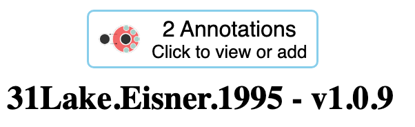

# Welcome to the LiPDverse!

The LiPDverse has been around for awhile now, but we've redesigned the website, added a blog, and did a bit more, so if even if you're a regular, this looks a bit new. So now that you're here, what should you do?

## 1. Explore LiPD datasets

We created the LiPDverse exists to be a simple and convenient way of accessing and exploring LiPD-formatted datasets. The primary way of doing this is by exploring the compilation projects hosted here. Check out the [projects](http://lipdverse.org/project) page to see the compilations available. There are several more compilations in various states of development, and as they get published we'll add them to the LiPDverse.

## 2. Take advantage of compilation and dataset versioning

A primary goal of LiPDverse is to support reproducibility. LiPD datasets and compilations frequently get updated as new data and metadata are added and as corrections are made. To accommodate the dynamic nature of these data sources, we've worked hard to develop a versioning system for both compilations and datasets. We've been gradually rolling this out and testing it over the past couple of years, so older compilations and datasets aren't as well versioned, but moving forward we aim to keep track of all the versions of both datasets and complations.

A blog post detailing compilation and dataset versioning is coming soon.

## 3. Annotate a dataset

LiPDverse data are connected to the [Throughput Annotation Engine](https://throughput-ec.github.io/). Just like it sounds, Throughput lets users annotate a dataset with notes that may be relevant to its use, how it should be interpreted, to point out something that's missing or incorrect. Anyone can read the annotations, and to add one, all you need is an ORCID. If you have one, go to your favorite dataset and annotate away! If you don't you can sign up at [orcid.org](http://orcid.org)

At the top of every LiPDverse dataset page is a widget that shows you the annotations in Throughput for that dataset. If there are already annotations, it will look like this:

{width="293"}

And clicking on the widget lets you read the annotations, or add a new one. Most datasets in the LiPDverse don't have annotations yet, and look like this:

{width="291"}

The Throughput Annotation Engineis a community tool that's better the more it gets used. Already, Thoughput connects datasets to codebases and funding, and can be queried to discover how other scientists are using data. So give it a try!

## 4. Build LiPDverse into your workflows

As we will showcase in the coming weeks and months with tutorials and examples in this blog, one of the most powerful ways to use LiPDverse is to build it into your scientific workflows. If you use R, you can already start your workflows with commands that access either the most recent or a specified version of a file or compilation. Every dataset page shows the code to load it directly into R:

{width="309" height="60"}

So you can just copy and paste and get going. Want to start your workflow with the most recent version of iso2k? Try:

`iso2k <- lipdR::readLipd("https://lipdverse.org/iso2k/current_version/current_version.zip")`

Want to make sure you're using version 1.0.0, regardless of future updates? Then:

`iso2k <- lipdR::readLipd("https://lipdverse.org/iso2k/1_0_0/iso2k1_0_0.zip")`

You can do also do this with individual datasets, using the link or datasetId. We'll be expanding and showing examples of this in future posts.

Want this in feature in python? We hear you! This will be included in the forthcoming pylipd package. Get in touch with Deborah Khider and Julien Emile-Geay for details.

## 5. Check out some tutorials

One of our main goals for this space is to showcase simple-to-complex examples and workflows that use LiPD data, LinkedEarth tools and/or LiPDverse, so stay tuned. Better yet, if you've something that you'd like to share, we'd love to have guest authors and highlight your work here!
