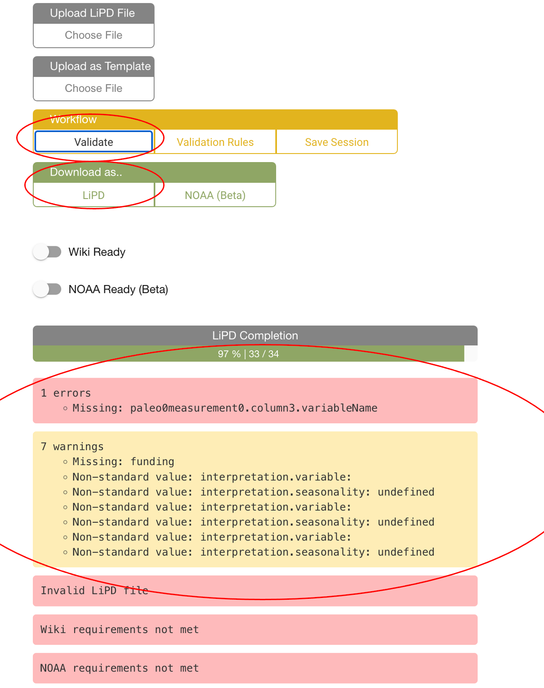
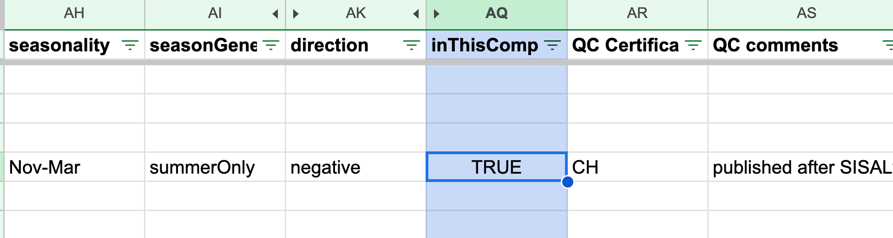

```{r setup, include=FALSE}
knitr::opts_chunk$set(echo = TRUE)
```

# Introduction

This notebook describes the workflow of using lipdverse tools to build and curate a paleoclimate data collection in LiPD.

## 1. Data folders

We use data folders to track store all the information associated with a paleoclimate record including the publication, original data, edited data, and eventually the LiPD file. Create a folder for each new site. The folders should be named following the **Site.Author.Year** format. **Site** refers to the where the data were collected (for example the lake name, cave name, ocean drill core etc). **Author** refers to the last name of the first author on the associated publication, and **Year** is the publication year. The data folder can also include a text file with notes about the record, such as problems with the file etc. Data folders and their contents are moved through the folder workflow outlined in the next section.

Example of a data folder.


#### 1.2 The Publication

When going through the publication, I like to highlight the important metadata that will be included in the LiPD file. Site name, coordinates, elevation, the variable needed, and text discussing the the climate interpretation can be useful to highlight so re-finding information is efficient. Data files downloaded from NOAA or Pangaea usually already have most of the necessary metadata.

#### 1.3 Prepare the data

Prepare your data to enter into a LiPD file. This is often easiest to do in excel or other spreadsheet program. Make sure all the empty values are populated by NaN, and not -9999 or something similar. Also make sure the ages are in the correct units for your project (yr BP, yr AD etc), and convert the units if necessary. Also make sure that the data are sorted by the age column. Plotting the data can be helpful to assess if there are problems with the data before entering them into the LiPD file.


#### 

## 2. The Folder Workflow

Tracking the data, metadata, and publication information is important for large data compilations. Data folders are moved through the folder workflow ensure nothing is lost and everything is appropriately tracked. The folder sequence is as follows:


#### 2.1 NeedToReview folder

As you search through public archives and other data repositories, data that might meet criteria can be quickly dropped into the **NeedToReview** folder. Afterwards, if the data meet the compilation criteria, they can be moved into the **AddToCompilation** folder. If the data fail criteria they can be moved into the **RejectFromCompilation** folder.

#### 2.2 NeedData folder

This folder is for sites that meet criteria, but for which the data have not been obtained. A text file describing what data are needed and what public archives have been searched (for example NOAA paleoclimate, Pangaea, Paper supplement etc), and what next steps are (such as email the original author, digitize the record etc.) should be included in the data sub folders. When the data are found, move the whole data folder into the **AddToCompilation** folder.

#### 2.3 AddToCompilation folder

Now it is time to make the LiPD file in the lipd.net/playground. Steps for making a LiPD file are detailed in the next section. Once you have a LiPD file, download it, put it into it's data folder, then move the data folder to the next step.

#### 2.4 InLiPDPendingLipdverse folder

Once you have enough LiPD files accumulating here, it is time to send them to Nick. Nick will add the LiPD files to lipdverse.org, and he will make a Google sheet (QC sheet) to QC your data in. We will describe several fields needed to be filled in using the QC sheet in section 4.

#### 2.5 AlreadyAddedToLipdverse folder

This is the last step in the folder workflow. Now you have a folder that tracks what data were considered, and also your thought process for why they were rejected.

#### 2.6 RejectFromCompilation folder

Put records that fail your criteria here. It is often useful to include a text file in the data folder that contains a note about why this record was rejected from your project (e.g., fails record duration, resolution, climate interpretation, age control etc).

## 3. Making a LiPD file!

#### 3.1 Navigate to lipd.net/playground

#### 3.2 Dataset Name

Enter the dataset name in the same **Site.Author.Year** format used for the data folder. Again, **Site** refers to the lake name, ocean core, etc. **Author** refers to the first author's last name. **Year** is the publication year. For example a LiPD file might be named: CasecadeFen.Maher.1963


#### 3.3 Select an Archive Type from the drop down menu

The Archive Type refers to the material sampled for the record. For example, archive types include Wood, LakeSediment, MarineSediment, Speleothem, Peat, Coral etc.


#### 3.4 Publication information

Click "add" below the publication icon. Copy and paste the DOI into the field, and click "autocomplete using DOI". Check to make sure all the fields have been correctly populated. In the example below, the fields Year, Pages, Edition, and Issue fields are missing.

{width="700"}

#### 3.5 Geographic Information.

Scroll down and fill in the **latitude**, **longitude**, **elevation**, and **Site Name** information. The **Site Name** field can also include the core name and other relevant site-level names to facilitate keyword searching of the database.

#### 3.6 Paleodata entry

Click the **Paleodata** button, then the **Add Column** button. Add the number of columns corresponding to your dataset.

Copy and paste the your data into the playground. Then click on the **Column 0** button


Populate the **Variable Name** field. In this case, Column 0 is the sample ID. Now move to **Column 1**.

{width="417"}

Column 1 of this dataset is the age column. Fill out the fields as follows, and move to the next column.

{width="369"}

In this dataset, the third column (labeled Column 2) is a d18O record with a paleoclimate interpretation of precipitation amount. Fill in **Variable Name**, **Units**, and **Proxy** information. Then click on the **interpretation 1** button


#### 3.7 Interpretation

Fill in the interpretation **variable**, **direction** (direction refers to the interpretation direction of the **variable**\--positive or negative) **scope** (often climate), and **seasonality**. The field **variableDetail** is also useful for some projects and is often entered in the what\@where format. In this case, the variable detail is indicating that the variable precipitation is measuring the amount at the earth surface. Temperature records might have a variable detail of air\@surface, sea\@surface, lake\@surface etc.


#### 3.8 Chronology information

If appropriate, enter the radiocarbon or other dating information into a **chronData** table following a similar approach to the paleodata table.

#### 3.9 Validate and download

Once you have finished entering data, navigate to the top of the playground page, and select **Validate.** A list of errors and warnings will appear. This is a good time to go back and fix anything important. Once you are happy with the LiPD file, select **Download**. Always be sure to download your file before navigating away from the playground or your changes will be lost. When you want to make more edits, you can upload the LiPD file back into the playground using the **Upload LiPD File** button.

{width="628"}

## 4. The QC Sheet

Once you have enough LiPD files, send them to Nick and he will make a google QC sheet for your project. Each row in the QC sheet represents one column in a LiPD file. Some fields are populated from the playground entries, some are calculated from the data automatically, and some fields must be entered using the QC sheet. The QC sheet is also an efficient place to add metadata and quality control all the LiPD files in your project. There are several critical fields to populate using the QC sheet, which I will cover here.


#### 4.1 InThisComp field

The most critical field to populate in the QC sheet is the **InThisComp** field. This field needs to be marked as TRUE for the variable you want to analyze. Again, each row in the QC sheet corresponds to a column in the data. For the Angelica Cave example, the d18O column was interpreted as a precipitation record that I want to include in this database. So, I must mark the d18O row as TRUE.



#### 4.2 QC comments

The **QC comments** are often project specific comments regarding the dataset such as why a data set was included, or other useful information. These comments can be initialed by whoever writes them so projects with many people can keep track of who reviewed the information.

#### 4.3 QC comments

The **paleoDataNotes** are a good place to record the climate interpretation justification. I usually copy and paste the climate interpretation text from the paper and put it within quotations.


#### 4.4 QC sheet tab DatasetsInCompilation

This is the first tab on the bottom of the QC sheet. This tab contains a column representing all the LiPD files in the lipdverse. If you want to include one in your project, simply mark it as TRUE

#### 4.5 Invalid terms tabs

We are working toward developing a standardized vocabulary of terms for many of the fields in LiPD files. The vocabulary generally aligns with NOAA's Paleoenvironmental Standard Terms (PaST) Thesaurus <https://www.ncei.noaa.gov/products/paleoclimatology/paleoenvironmental-standard-terms-thesaurus>. The standardization of terms is still a work-in-progress, so you may come across terms that have not been standardized yet. Nonetheless, these these tabs highlight incorrect terms, and they can be corrected here as well.
