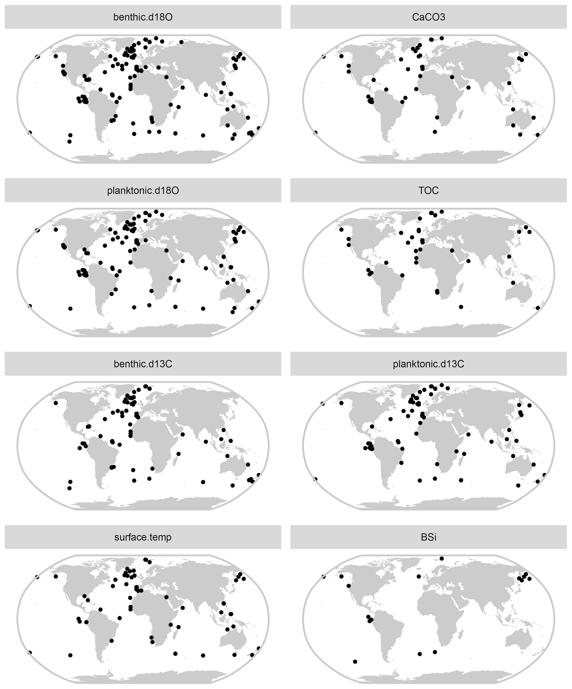
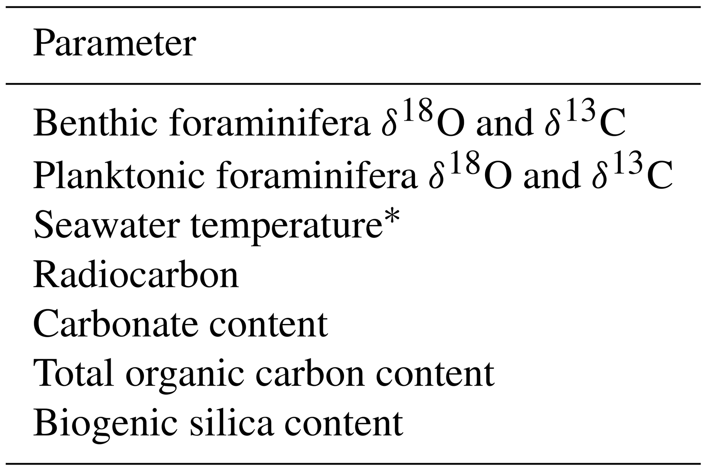

## Introduction

The PalMod data compilation is a multi-parameter marine palaeoclimate data synthesis that contains time series spanning 0 to 130,000 years ago. The compilation includes only time series for which a robust chronology based on benthic foraminifera $\delta^{18}O$ and radiocarbon dating is available. Version 1.0.0 of the data product contains 896 time series from 143 individual sites, each associated with rich metadata, age--depth model ensembles, and information to refine and update the chronologies. Those 896 timeseries are comprised of 205 benthic foraminifera $\delta^{18}O$ records; 169 of benthic foraminifera $\delta^{13}C$; 131 of seawater temperature; 174 and 119 of planktonic foraminifera $\delta^{18}O$ and $\delta^{13}C$; and 44, 38 and 16 of carbonate, organic carbon and biogenic silica content, respectively.

{width="685"}

## [Data](http://lipdverse.org/PalMod/current_version/)

Data access and LiPDverse visualizations are [available here](http://lipdverse.org/iso2k/current_version/).

## [Publication](https://essd.copernicus.org/articles/12/1053/2020/)

A data descriptor for the compilation was published in Earth System Science Data and is [available here](https://essd.copernicus.org/articles/12/1053/2020/).

## How to cite this compilation

Jonkers, L., Cartapanis, O., Langner, M., McKay, N., Mulitza, S., Strack, A., and Kucera, M.: Integrating palaeoclimate time series with rich metadata for uncertainty modelling: strategy and documentation of the PalMod 130k marine palaeoclimate data synthesis, Earth Syst. Sci. Data, 12, 1053--1081, <https://doi.org/10.5194/essd-12-1053-2020>, 2020.

## Criteria for inclusion {#criteria}

The complete criteria for inclusion are described in the [manuscript](https://essd.copernicus.org/articles/12/2261/2020/), but in short: To be included in the PalMod compilation, a dataset must meet several criteria:

1.  **Marine paleoclimate data comparable with model output**

The high-priority selection includes both physically and biogeochemically relevant parameters, of which some are based on measurements that can be compared with climate model output using (forward proxy) models (e.g. benthic $\delta^{18}O$) and others represent inferred parameters that can be compared with model output more directly but for which proxy models are still in their infancy (e.g. temperature based on foraminifera Mg∕Ca).

{width="398"}

Only variables listed here were included:

2.  **Record resolution and duration** e prioritized processing time series that we estimated to contain at least 50 data points within the 130,000-year timeframe

3.  **Chronology** , Palmod standardized all chronologies by combining absolute ages (radiocarbon ages, tephra layers and palaeomagnetic events) with $\delta^{18}O$ stratigraphy. As a result, the age models may differ from those reported in the original publication(s). This does not mean that the updated age models are better (constrained), but they are constructed in a way that allows for applicability and consistency across the synthesis. Only datasets that had sufficient $^{14}C$ and benthic $\delta^{18}O$ datasets to develop a robust chronology were included.

4.  **Publically archived data** Only datasets that were publicly archived through [Pangaea](https://pangaea.de/) or the [World Data Service for Paleoclimatology](https://www.ncei.noaa.gov/products/paleoclimatology) [FTP site for marine data](ftp://ftp.ncdc.noaa.gov/pub/data/paleo/paleocean//sediment_files/complete) were considered for inclusion.

## [Long-term archival](https://doi.pangaea.de/10.1594/PANGAEA.908831)

The PalMod compilation is archived at Pangaea, and are [available here](https://doi.pangaea.de/10.1594/PANGAEA.908831).
